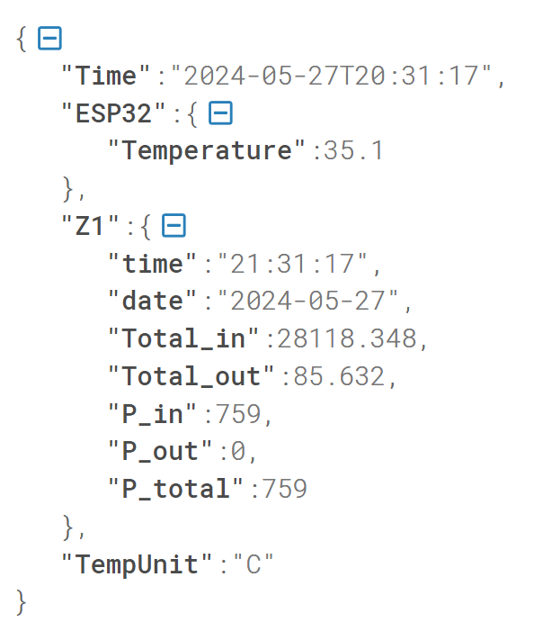

# Tasmota-TD3511-MBus
Tasmota Berry Script for Smart Meter TD-3511 used in Upper Austria (Netz OÖ)

## Description
This Berry Script can be used with Tasmota https://tasmota.github.io/docs/ on ESP32-Modules.
It can read Siemens Smart Meters of Type TD-3511 which are used in Uppper Austria by Netz OÖ / Energie AG.
The script acts as M-Bus client and reads the values provided by the smart meters every second.
More than one smart meter can be attached to an ESP32 and read out.

I didn't find a way to use the https://tasmota.github.io/docs/Smart-Meter-Interface/ to act as M-Bus-Client, so i tried Berry Scripting...

The known Tasmota-Scripts for TD-3511 can read the Netz-OÖ-smart meters only with 300Bd and update the values only every 5 minutes.
See https://magnatdebonblog.wordpress.com/offtopic-smart-meter-der-energie-ag-mit-esp-32-auslesen-und-per-mqtt-weitergeben/

There are ready-to-use M-Bus-IR-readers available e.g. here (not sold by me!) : https://github.com/mgerhard74/amis_smartmeter_reader

Specification of AMIS Smart Meter M-Bus interface: https://www.netzooe.at/2021-11-05-spezifikation-ks-amis.pdf?ch=ttzaxj8g&:hp=3;2;de

Other FAQs from Netz-OÖ: https://www.netzooe.at/themen/information/smart-meter/faq


## Requirements / Setup
#### Compile Tasmota with Berry and Crypto-Support
You need to compile a Tasmota version with this minimal settings - see https://tasmota.github.io/docs/Compile-your-build/
```
// Berry cripting and SML for SmartMeters
#ifndef USE_SCRIPT
  #define USE_SCRIPT
#endif
#ifndef USE_SML_M
  #define USE_SML_M
#endif
#ifdef USE_RULES
  #undef USE_RULES
#endif
#ifndef USE_TLS
  #define USE_TLS
#endif
#ifndef USE_BERRY_DEBUG
  #define USE_BERRY_DEBUG
#endif
#ifndef USE_BERRY_CRYPTO_AES_CBC
  #define USE_BERRY_CRYPTO_AES_CBC
#endif
```
### Serial IR Smart-meter Reader
For every smart meter you need a IR-Serial-Transceiver connected to ESP32 Serial Pins (you need RX and TX)

Like this one: https://www.amazon.de/Hichi/dp/B0BPMVX4VW?th=1

### Upload Berry Script-Files
Upload all *.be Files via the Tasmota-Web-Interface to the ESP32 (Tools -> Manage File System)


### Configure Script
Edit the file td3511_setup.be and change RX/TX-Pins and AES-KEY and ID for every smart meter you need. You can edit in Tasmota with the "Edit-Icon" in Manage Filesystem.

The Section for Initializing one Smart-Meter looks like this:

```
# Zähler Haushalt
td3511_HH=TD3511MBUS(46,45,bytes('11C5151F9CB6EFD13E411B815CD62769'), "Z1")
tasmota.add_driver(td3511_HH)
print("Driver td3511_HH:TD3511MBUS initialized")
```

### Configure Teleperiod
The frequency for sending MQTT-Messages must be adjusted in Tasmota:  

Configuration->Configure Logging-> Telemetry period (e.g. 10seconds)

### Reboot the ESP32 
Reboot from Tasmota Main-Menu and wait....


## Usage
After correct initialisation the smart meter starts sending packets with data.

### Main View
You can see the values in the Main-View of Tasmota:


### Berry Console
The Berry Console gives more debug output


### MQTT
At the moment only some values are sento via MQTT with the constant "Z1" for the first (and now only) smart meter.



## Disclaimer
This software is in a very pre-beta-state! 
I can't be held responsible for any problems by using this software!

## Thanks
Thanks to @mgerhard74. His software was a excelent starting point for this Tasmota-Scipt.
